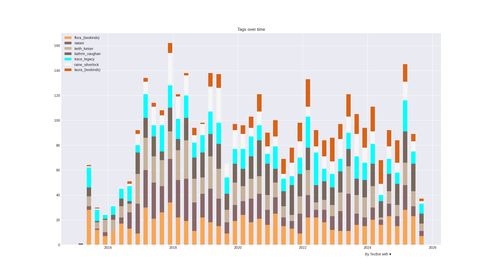

# Twokinds Tag Analysis

## August 9th 2025

### Introduction

Hello! Welcome to this first edition of Twokinds of Data: Character analysis. You may have seen my work before [for example here](https://github.com/Technic-bot/tk_rating_analysis/blob/main/posts/Lewd_monitor_01_07_2025.md) where I compare the number of sfw and nsfw artwork over time. This time i do something very similar but not limited to the artwork rating but with the characters that appear on each piece.
The idea is that lets us see trends over time in character popularity, how often they get drawn and what not.
So in short this is a generalizion of my work regarding rating analysis on twokinds art to any sort of tag that may accompany it.

Originally I started this idea because the system Tom, the author of twokinds, used for sketch sugegstions broke around december 2024 and his sunda sketches have been chosen by him since then. 
And i wanted to see if there was any significant change in what gets drawn now compared to back when his patrons could vote directly for stuff.
Although this is and will be for focused on twokinds artworks ~~beacause i am obssesed~~ the methods here should work for any artist of query you can make as long as it has the proper tag groups

So in this document we will go through my methodology, talk about how i get and process the data and finally will go through a couple graphs i made. Since this is the first time it will be a bit sparse on visualizations and will add more over time depending on the feedback i get and stuff i want to see myself.

### Methodoly

As with my work on rating analysis i get the information from e621.net json api. this time i queried for anything tagged with tom_fischbach.
In my other repos i usually did used different queries for color and non color art but this time wanted to get everything under Tom's name for starters.

Once i get the data from there and remove some useless information I store it as a json, which you can also get in [this same repo](../data/2025/tom-26-jul-25.json) if you want to play with it youself.
There is also a csv version you can probably open on excel or google calc if you want but the true input to my program is on json because is simpler to me.

Details on how this works are provided on this [repo README.md](../README.md) and should not change significantly over time so wont repeat it here. You can check that file out if you want an slightly more details on how these scripts work. 

At the end of the day the data is grouoped per tags and per a period of time, usually a quarter and presented as a quaint little bar graph.

### Top tags

So before getting to graphs i wanted to see what were the top tags for artworks by Tom.
For e621 there are 4 categories of tags: Characters, species, meta and general tags. All i assume are self explanatory. 
So got all unique tags found in Tom art and listed them  on decreasing order of frequency they appear on every artwork.
In total we got 4627 individual artoworks in this time. You can find the full result [in this repo  too](results/top_tags/tom_fischbach/) but the top 5 tags of each category are as follows:

#### Characters:

Surprise here is that tog character is Flora, she is argueably the main character so on second though it should not be that much of a surprise.

| Character | Frequency |
| --------- | --------- |
|   Flora   |   997     |
|   Natani  |   778     |
|   Keith   |   775     |
|   Kathrin |   689     |
|   Trace   |   682     |

#### Species

A big surprise here is that non character tags may be duplicated or redundant. Canid and canine is most likely the same as Canid in this case. Also Tom seems to have a minor preference over doggys

| Species | Frequency |
| --------- | --------- |
|   Mammal  |   4480     |
|   Keidran |   3696     |
|   Canid   |   2680     |
|   Canine  |   2678     |
|   Felid  |   2280     |

### Tags
These are general tags. At first i was gonna graph over this too but honestly the top tags are quite boring. These are 100% correct and make sense but graphing this would be quite boring, only interesting thing here is that the clothed/clothing tag is very very common despite Tom being known from drawin naked characters

|   Tags        |   Frequency   |
|   ----        |   -----   |
|   Female      |   4228    |
|   Anthro      |   4217    |
|   Clothing    |   3471    |
|   Clothed     |   3101    |
|   Fur         |   2971    |

### Meta
A very recent category so just adding it here for completeness

|   Tags        |   Frequency   |
|   ----        |   -----   |
|   Digital media      |   3803    |
|   Adobe Photoshop      |   3572    |
|   Sketch      |   3249    |
|   Hi resolution     |   3058    |
|   Monochrome         |   3050    |

Again nothing interesting here

## Characters over time
Now the interesting part. The following graph shows the number of times an specific character was mentioned in the tags of every artwork and grouped for each quarter. 
In other words it mentions how many artworks have and specific tag pver a range of time.
Data prior to februrary 2015 was pruned since it becomes quite messy before that, likely someone mass uploaded Tom art to the site around 2014 so it does not give us much information.

Initially i tried to use each character color for visualization but i had not realized just how monotone Tom designs are and it is hard to read so made this one with the automatic color cycle for ggplot:

And one for seaborn just for good luck

So we see a very stable number of characters over time. Only significant change seems to be we are getting very little laura this year. At least compared to prior years
