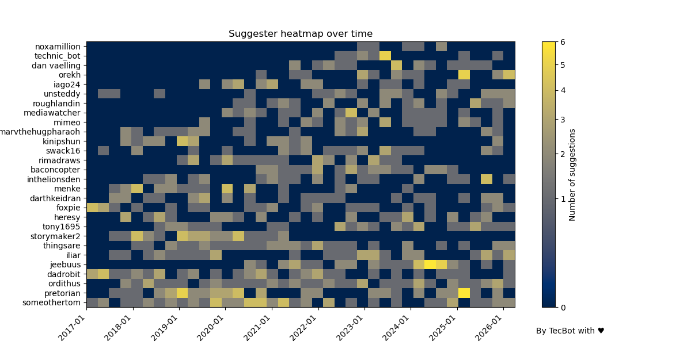
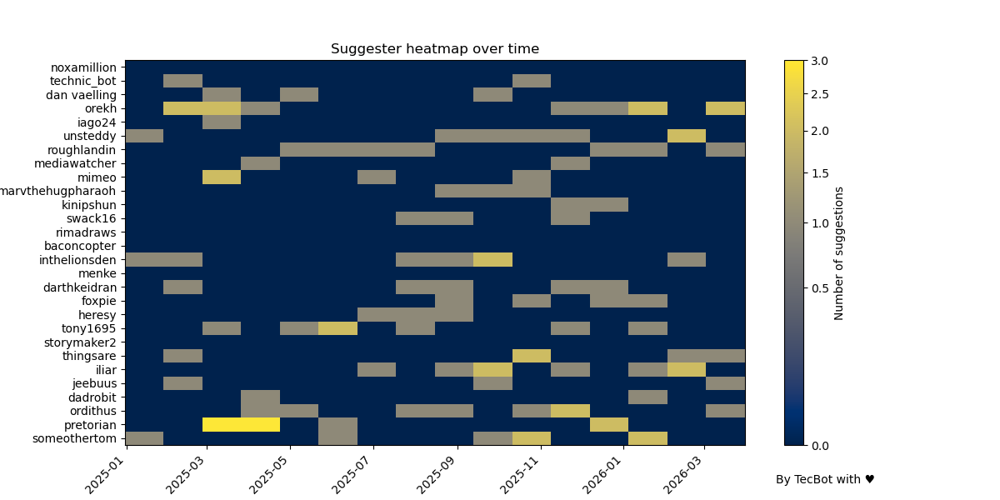
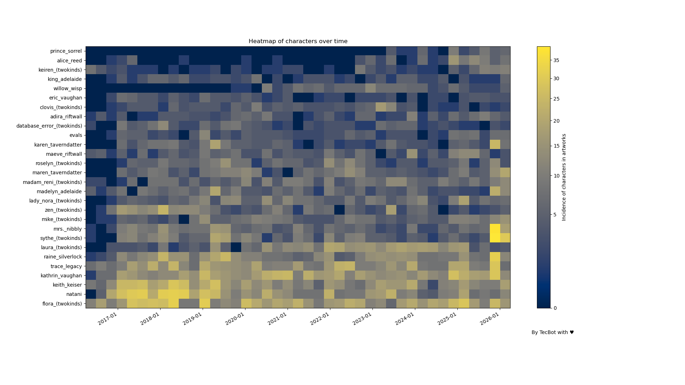
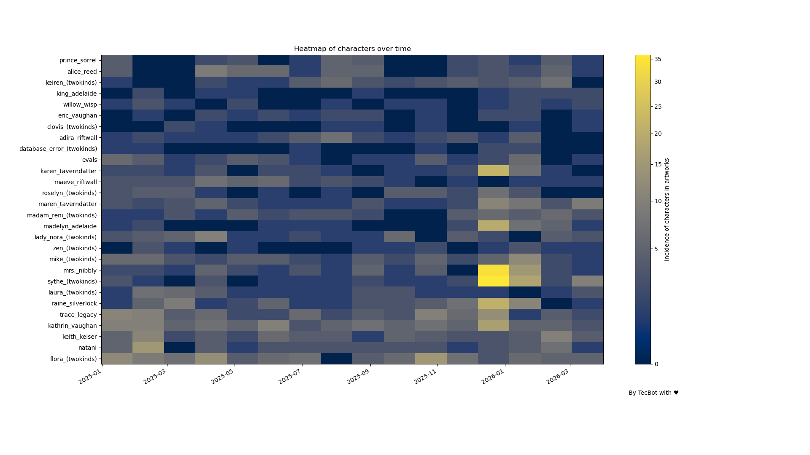

# Twokinds of Data
## Suggester trends over time

## March 26 2026

So I am back at this, [last time](./2026-jan-25.md) presented my first heatmap based around the analysis of which twokinds characters were sketched or drawn over time since patreon inception based on e6 data. 

But then i wondered is there any other information that would be interesting to know? As discussed on the prior two posts i made they provide little information other than most post having women in it which is an insigth until you realize it is obvious.

Then I realized i always wanted to know who has the most suggested sketches so far, but that information is buried on patreons descriptions. But I have catalogued every since patreon posts for my [Twokinds Gallery](https://tecrobot.org/twokinds/gallery/) which includes the description... And i know regex.

So after some work in a new [script](tag_analyzer/graph_suggesters.py) that was able to extract the suggesters from the description i was ready to graph this in the same way i did with character tags!

## Methodology

As a brief summary of what i did here. For my gallery i collect and collate every art post on Tom [patreon](https://www.patreon.com/c/twokinds/posts) including the description. Whenever Tom post suggested sketches or finished artwork he adds some attribution in the form of `suggested by <someone>` which is something i can extract. 

Once the suggester information was split from the rest is relatively easy to extract it in much the same way I used for the e6 tags. After that i got the top 25 suggesters with the most pieces credited to them and sliced the data accordingly and then i could pivot the dataframe into a heatmap again.

But before showing the results some small notes on changes
1- Fixed the alignement on the heatmap bins in the y axis
2- Changed color map, cividis is meant to prevent perceptual aliasing
3- Minor improvements in format 

Oh also reran my numbers on the tags with up to date data, will be at the bottom of this one. If you want the methodology for that one please refer to the prior post linked somehwere above

### Limitations
There are a couple issues i should mention, first not all post have a suggeter attached to it, sometime Tom forgets and piece is simply something he came up for/by himself. Second it is arbitrary text parsing so i did not get all of them. Sometimes usernames where weird, sometimes Tom did not added them proper etcetera. In particular I was not able to parse multiple suggesters so that information is excluded from the graphs. Alas i do not think this changes overall results much.

You can check [this csv](../data/2026/march/patreon_top_suggesters.csv) to see the list of all extracted suggesters and the number of suggestions overall.

## Suggester activity over time

And so here we go:

Since we moved ove from polls to All-Tom picks also made a special  grapph with only data from the past year till today:

## Tags over time

To accompany the data above did the same exercise as last time from e6 data: 

And of course added a version with only data from 2025 and beyond to account for all  the new All-Tom picks system.

## Discussion

I first made this to see if there was any meaningfull change in who was selected for sketches before and now. And at least for the top 25 suggesters do not see much difference from who is getting sketched between back then with tk polls and now, if anything i kinda see the suggesters are more spread. 

Though it is interested to note that some of the people with the most sketches ever stopped having any years ago. Probably unsubcribed but their mark is now unmistakeable on Tom work.

Also i had notice someothertom from the first time i started paying attention to the suggesters, but never expected this guy to be top suggester since the start.

Regarding the heatmap for the characters is important to note that for these graphs do not match exactly with the patreon graphs. Because i got everything made by Tom and this includes stuff like pixie panic, his own doddles etc, twitter post never shown in patreon, page sketches etc, since it is basically impossible to separate those from there.Which also explains the Sythe and Nibss spike in december 25, that is when tom was posting magical mishaps on patreon.

Otherwise is the same as last time i did. Nothing out of the ordinary, we are stil living in a post-laura world. 

Oh of course did added Sorrel and Reed tags over there. And we do see a sharp increase in lynx content the past year. But I do not think anyone is surprised. Tom loves his lynxes

